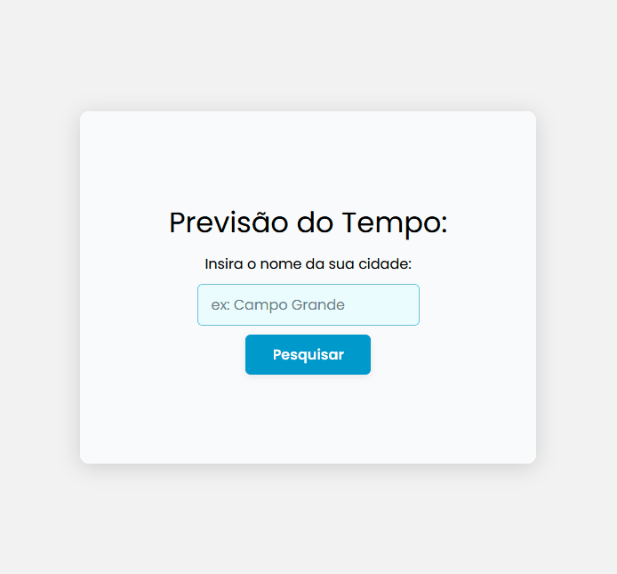

# 🌦️ Weather API Project

Um projeto simples de consulta de clima, onde o usuário pode inserir o nome de uma cidade e visualizar informações como **temperatura** e **umidade** em tempo real.  
Os dados são obtidos utilizando a [WeatherAPI](https://www.weatherapi.com/).

---

## 📸 Demonstração



---

## 🚀 Funcionalidades

-   Formulário para digitar o nome da cidade.
-   Consulta de temperatura atual.
-   Exibição do nível de umidade.
-   Interface simples e responsiva.

---

## 🛠️ Tecnologias Utilizadas

-   **HTML5** – Estrutura da aplicação.
-   **CSS3** – Estilização da interface.
-   **JavaScript** – Lógica e integração com API.
-   **[WeatherAPI](https://www.weatherapi.com/)** – Fornecedora dos dados meteorológicos.

---

## 📦 Como Usar

1. **Clone o repositório**
    ```bash
    git clone https://github.com/lincolnsadler/WeatherApiProject.git
    ```
